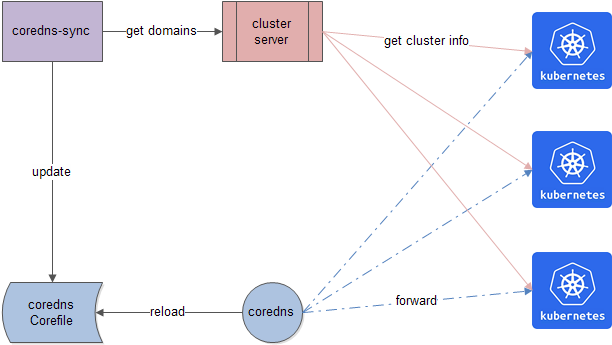

## coredns-sync

A kubernetes-native coredns-sync daemon which helps to synchronize dynamic cluster domains to coredns.

## Principle

`coredns-sync` is kept as simple as possible to guarantee its stability, and the principle of coredns-sync can be illustrated as follows:



## precondition

* coredns-sync shares disk with coredns(running on the same machines).
* coredns needs to enable [file](https://coredns.io/plugins/file/) and [reload](https://coredns.io/plugins/reload/) plugins(both of them are internal plugins and compiled into the default CoreDNS).

### Run

#### Run external

`coredns-sync` can be run outside of the kubernetes as below:

```bash
$ bash hack/start.sh
```

And in this situation, you may need to keep it high-available by some means.

#### Run internal

Running `coredns-sync` inside a kubernetes is more convenient compared with the external as [kubernetes daemonset](https://kubernetes.io/zh/docs/concepts/workloads/controllers/daemonset/) helps to keep it high-available.

```
# prepare image
$ make dockerfiles.build
# retag and push to your docker registry
$ docker tag duyanghao/coredns-sync:v0.1.0 xxx/duyanghao/coredns-sync:v0.1.0
$ docker push xxx/duyanghao/coredns-sync:v0.1.0
# Update the daemonset to use the built image name
$ sed -i 's|REPLACE_IMAGE|xxx/duyanghao/coredns-sync:v0.1.0|g' hack/daemonset/coredns-sync.yaml
# deploy coredns-sync daemonset and relevant configmap
$ kubectl apply -f hack/daemonset/configmap.yaml
configmap/coredns-sync created
$ kubectl apply -f hack/daemonset/coredns-sync.yaml 
daemonset.apps/coredns-sync created
```

And the logs will appear as follows: 

```
I1213 02:17:08.101588       1 main.go:187] =================== sync coredns loop: 1  =====================
I1213 02:17:08.119337       1 main.go:192] getClusterDomainList successfully
I1213 02:17:08.119363       1 main.go:131] cluster domain info: a.xxx.com => 192.168.0.1
I1213 02:17:08.119417       1 main.go:140] zone: /etc/coredns/zones/a.xxx.com content ok
I1213 02:17:08.119714       1 main.go:131] cluster domain info: b.xxx.com => 192.168.0.2
I1213 02:17:08.119855       1 main.go:140] zone: /etc/coredns/zones/b.xxx.com content ok
I1213 02:17:08.119880       1 main.go:160] ========cluster info stay unchanged, there is no need to update coredns========
I1213 02:17:08.119890       1 main.go:197] syncCoredns successfully
```

## Refs

* [coredns configuration](https://coredns.io/manual/configuration/)
* [coredns deploy](https://github.com/coredns/deployment/tree/master/systemd)
