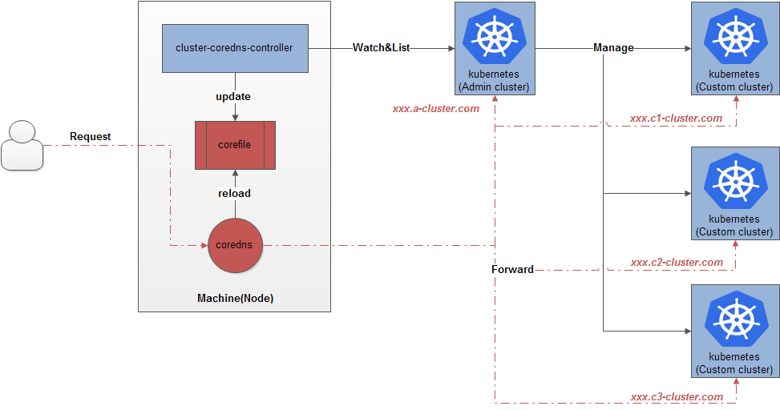
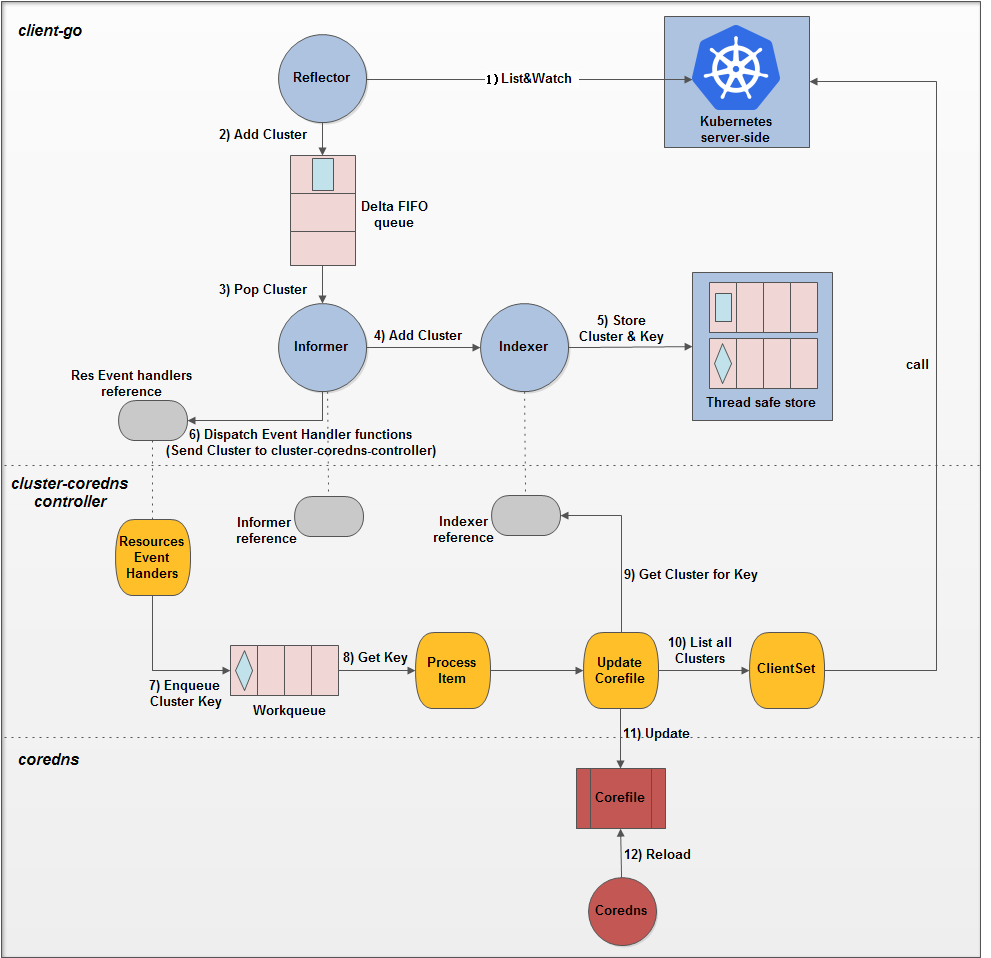

# cluster-coredns-controller

This repository implements a [tke-cluster](https://github.com/tkestack/tke) [coredns](https://coredns.io/manual/configuration/) controller which helps to synchronize dynamic cluster domains as defined in TKE-Platform Aggregated API Server to coredns, and customers can have access to all of the ingress of both admin and custom clusters through one coredns.

## Precondition

* `cluster-coredns-controller` shares disk with coredns(running on the same machines).
* coredns needs to enable [file](https://coredns.io/plugins/file/) and [reload](https://coredns.io/plugins/reload/) plugins(both of them are internal plugins and compiled into the default CoreDNS).
* the ingress hosts of both `admin` and `custom` clusters are suffixed by `TKE cluster name`+`wildcardDomainSuffix`(for example, xxx.cluster-a(`cluster-name`).com(`wildcardDomainSuffix`)). 

## Principle

The cluster-coredns-controller is a kube-like controller(refer to [sample controller](https://github.com/kubernetes/sample-controller)) which watches the Kubernetes API for the TKE Cluster and synchronizes dynamic cluster domains to coredns by updating the Corefile and relevant Zonefile. The principle of cluster-coredns-controller is similar to [ingress-nginx-controller](https://github.com/kubernetes/ingress-nginx) and can be illustrated as follows:



## Details

The details of interaction points of the cluster-coredns-controller with TKE kubernetes and `coredns` show below(refer to [client-go under the hood](https://github.com/kubernetes/sample-controller/blob/master/docs/controller-client-go.md)):



As `coredns` uses [Declarative Configuration](https://docs.konghq.com/2.0.x/db-less-and-declarative-config/#what-is-declarative-configuration), the `cluster-coredns-controller` will list all TKE clusters and modify the Corefile and relevant Zonefile appropriately for dynamic cluster domains whenever it receives an event of cluster from kubernetes:

* domain ADD: add relevant cluster zone item to the Zonefile and update the Corefile 
* domain DELETE: delete relevant cluster zone item from the Zonefile and update the Corefile
* domain UPDATE: update relevant cluster zone item in the Zonefile and update the Corefile

`cluster-coredns-controller` makes coredns use [reload plugin](https://github.com/coredns/coredns/tree/master/plugin/reload) once per Server Block, which allows automatic reload of a changed Corefile. After these changes, coredns will reload the Corefile and validate it, and finally customers can have access to relevant TKE kuberentes services by ingress.

## Running

### External

cluster-coredns-controller can be run outside of the kubernetes as below:

```sh
$ bash hack/start.sh
```

And in this situation, you may need to keep it high-available by some means.

### Internal

Running `cluster-coredns-controller` inside a kubernetes is more convenient compared with the external as kubernetes daemonset helps to keep it high-available:

```sh
# generated image
$ make dockerfiles.build
# retag and push to your docker registry
$ docker tag duyanghao/cluster-coredns-controller:v2.0 xxx/duyanghao/cluster-coredns-controller:v2.0
$ docker push xxx/duyanghao/cluster-coredns-controller:v2.0
# Update the daemonset to use the built image name
$ sed -i 's|REPLACE_IMAGE|xxx/duyanghao/cluster-coredns-controller:v2.0|g' examples/daemonset/daemonset.yaml
# create configmap
$ kubectl apply -f examples/daemonset/configmap.yaml
# create cluster-coredns-controller daemonset
$ kubectl apply -f examples/daemonset/daemonset.yaml
```

## Configuration

The following table lists the configurable parameters of the `cluster-coredns-controller` and the default values.

| Parameter                                                                   | Description                                                                                                                                                                                                                                                                                                                                     | Default                         |
| --------------------------------------------------------------------------- | ----------------------------------------------------------------------------------------------------------------------------------------------------------------------------------------------------------------------------------------------------------------------------------------------------------------------------------------------- | ------------------------------- |
| **ClusterServerCfg**                                                             |
| `clusterServerCfg.masterURL`                                                               | The address of the Kubernetes API server. Overrides any value in kubeconfig.                                                                                                                                                                                                                                                                          | `https://tke-platform-api`                        |
| `clusterServerCfg.kubeConfig`                                                        | Path to a kubeconfig.                                                                                                                                                                                                                                                                                                                            | `/app/conf/tke-platform-config.yaml`                          |
| `clusterServerCfg.enableEvent`                                                        | Whether to create event broadcaster.                                                                                                                                                                                                                                                                                                                           | `false`                          |
| **coreDnsCfg**                                                             |
| `coreDnsCfg.corefilePath`                                                       | Path to Corefile of coredns                                                                                                                                                                                                                                                                                                              | `/etc/coredns/Corefile`                          |
| `coreDnsCfg.zonesDir`                                                       | Directory of zones                                                                                                                                                                                                                                                                                                              | `/etc/coredns/zones`                          |
| `coreDnsCfg.wildcardDomainSuffix`                                                       | wildcardDomainSuffix of Cluster                                                                                                                                                                                                                                                                                                              |                           |
| `coreDnsCfg.interval`                                                       | Interval of coredns reload                                                                                                                                                                                                                                                                                                              | `2s`                          |
| `coreDnsCfg.jitter`                                                       | Jitter of coredns reload                                                                                                                                                                                                                                                                                                              | `1s`                          |

## Compatibility

HEAD of this repository will match HEAD of [tkestack/tke](https://github.com/tkestack/tke).

## Refs

* [coredns configuration](https://coredns.io/manual/configuration/)
* [sample-controller](https://github.com/kubernetes/sample-controller)
* [tkestack/tke](https://github.com/tkestack/tke)
